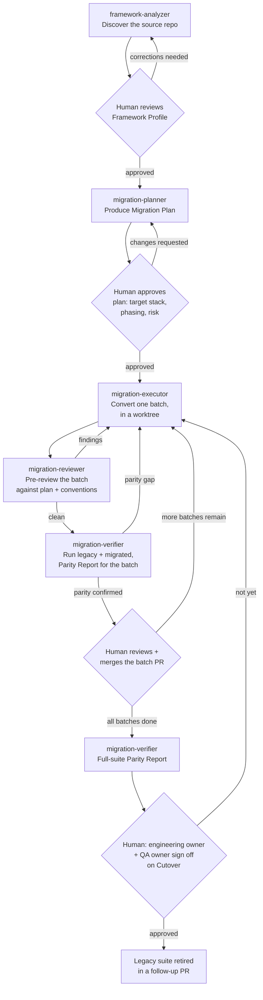

# Workflow

The end-to-end process, one project at a time. Every diamond below is a human
approval gate — no agent output crosses one on its own.

## Stage reference

| # | Stage | Agent | Reads | Produces | Gate | Approver |
|---|---|---|---|---|---|---|
| 1 | Discover | `framework-analyzer` | source repo (read-only) | Framework Profile | Accuracy review | Tech lead / SME |
| 2 | Plan | `migration-planner` | Framework Profile(s) | Migration Plan | Scope/stack/phasing approval | Engineering owner |
| 3 | Convert (per batch) | `migration-executor` | Migration Plan + source | code diff, in a worktree branch | — (feeds stage 4) | — |
| 4 | Pre-review | `migration-reviewer` | the diff + Migration Plan + `playwright-conversion-patterns` | findings list | Must be clean before stage 5 | — (automated gate, not human) |
| 5 | Verify (per batch) | `migration-verifier` | legacy + migrated tests, run | Parity Report | Parity must hold before merge | — (automated gate, feeds stage 6) |
| 6 | Merge | — | the reviewed, parity-confirmed diff | a merged PR | Human review + merge | Reviewer with merge rights |
| 7 | Final verify | `migration-verifier` | full legacy + full migrated suite | full Parity Report | Cutover readiness | QA/test owner |
| 8 | Cutover | — | Policy §Cutover criteria | legacy suite removed | Joint sign-off | Engineering owner + QA owner |

Stages 3–6 repeat once per batch. A project's Migration Plan defines the batch list and
order (see `templates/migration-plan.template.md`); `migration-planner` typically
sequences low-risk, high-value batches first (e.g. a single self-contained page/resource
with no cross-cutting dependencies) to prove the pattern before tackling anything with
shared state or complex fixtures.

## Where humans are in the loop, explicitly

- **Gate B**: nobody starts planning against a Framework Profile that's wrong about the
  tech stack — this is the cheapest place to catch a misread.
- **Gate D**: target-stack and phasing are standing decisions with cost beyond this one
  migration (see Policy §Target stack) — never rubber-stamped by an agent.
- **Gate H**: every batch, every time. Small batches make this gate cheap to exercise
  honestly instead of becoming a formality.
- **Gate J**: retiring the safety net for the application under test is the highest-risk
  action in this whole workflow — it gets two named approvers, not one.

## What "dry run" means in this toolkit

Running stages 1–2 (Discover, Plan) against a repo without proceeding to stage 3 is a
valid, complete use of this toolkit on its own — it produces a Framework Profile and a
Migration Plan a team can read, argue about, and revise before committing any engineer
time to actual conversion. See `dry-run/stock-broker-java-test/` for exactly this.
