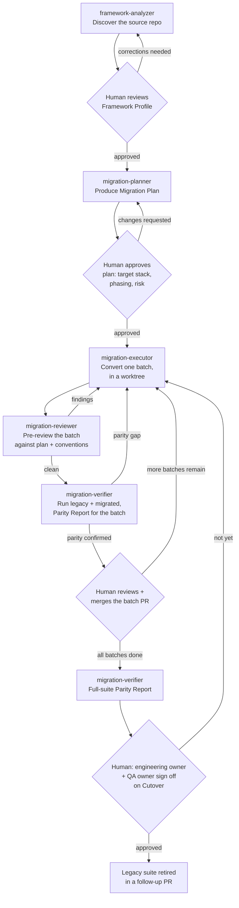

# Workflow

The end-to-end process, one project at a time. Every diamond below is a human
approval gate — no agent output crosses one on its own.

## Stage reference

| # | Stage | Agent | Reads | Produces | Gate | Approver |
|---|---|---|---|---|---|---|
| 1 | Discover | `framework-analyzer` | source repo (read-only) | Framework Profile | Accuracy review | Tech lead / SME |
| 2 | Plan | `migration-planner` | Framework Profile(s) | Migration Plan | Scope/stack/phasing approval | Engineering owner |
| 3 | Convert (per batch) | `migration-executor` | Migration Plan + source | code diff, in a worktree branch | — (feeds stage 4) | — |
| 4 | Pre-review | `migration-reviewer` | the diff + Migration Plan + `playwright-conversion-patterns` | findings list | Must be clean before stage 5 | — (automated gate, not human) |
| 5 | Verify (per batch) | `migration-verifier` | legacy + migrated tests, run | Parity Report | Parity must hold before merge | — (automated gate, feeds stage 6) |
| 6 | Merge | — | the reviewed, parity-confirmed diff | a merged PR | Human review + merge | Reviewer with merge rights |
| 7 | Final verify | `migration-verifier` | full legacy + full migrated suite | full Parity Report | Cutover readiness | QA/test owner |
| 8 | Cutover | — | Policy §Cutover criteria | legacy suite removed | Joint sign-off | Engineering owner + QA owner |

Stages 3–6 repeat once per batch. A project's Migration Plan defines the batch list and
order (see `templates/migration-plan.template.md`); `migration-planner` typically
sequences low-risk, high-value batches first (e.g. a single self-contained page/resource
with no cross-cutting dependencies) to prove the pattern before tackling anything with
shared state or complex fixtures.

## Artifact reference

The Stage reference table above names inputs/outputs loosely ("Framework Profile",
"Parity Report"). This is the precise version: which template backs each artifact, and
where it lives.

| # | Stage | Input artifact(s) | Output artifact | Backing template | Where it's saved |
|---|---|---|---|---|---|
| 1 | Discover | source repo (live code, not an artifact) | Framework Profile | `templates/framework-profile.template.md` | Engagement's choice of convention — this toolkit doesn't fix a path. `dry-run/<project>/framework-profile.md` for a dry run; e.g. `migration-artifacts/<project>/framework-profile.md` for a live engagement |
| 2 | Plan | Framework Profile(s) (path(s) from stage 1) | Migration Plan, ID'd `<project>-migration-plan-v<n>` | `templates/migration-plan.template.md` | Same convention, alongside the profile — e.g. `dry-run/<project>/migration-plan.md` |
| 3 | Convert (per batch) | approved Migration Plan (one batch ID) + legacy source (read reference only) | a code diff on branch `playwright-migration/<batch-id>`, plus an in-session batch summary (batch ID, branch, what converted, anything flagged) | **none** — deliberate; the diff itself is the artifact, and the summary is a handoff to stage 4, not paperwork meant to persist on its own | the worktree/branch; the summary lives in the session transcript that stages 4-6 read directly |
| 4 | Pre-review | the diff from stage 3 + the Migration Plan + `playwright-conversion-patterns` skill | a Clean-or-Findings verdict + findings list | **none** — same reasoning as stage 3: this gate is meant to be cheap and re-run freely, not to accumulate a report per run | in-session only, read by whoever routes the batch to stage 3 (findings) or stage 5 (clean) |
| 5 | Verify (per batch) | legacy suite + migrated suite, both executed | Parity Report, scope = the batch | `templates/parity-report.template.md` | e.g. `migration-artifacts/<project>/parity-reports/<batch-id>.md` |
| 6 | Merge | the diff + stage 4's Clean verdict + stage 5's Parity Report | a PR (description + the merge itself) | `templates/pr-checklist.template.md`, pasted into the PR body per its own header instruction | the PR itself — this is the one artifact in the table that isn't a toolkit-folder file; it lives in the forge (GitHub/GitLab/etc.) |
| 7 | Final verify | full legacy suite + full migrated suite, both executed | Parity Report, scope = "full suite" | `templates/parity-report.template.md` (same template — the header's scope field distinguishes a batch report from a full-suite one) | e.g. `migration-artifacts/<project>/parity-reports/final.md` |
| 8 | Cutover | stage 7's full Parity Report + `governance/POLICY.md` §Cutover criteria + confirmation all batch PRs are merged | a follow-up PR that removes the legacy suite, with joint sign-off recorded in its body | none dedicated — an ordinary PR; reuse the sign-off style from `pr-checklist.template.md` if useful | the PR itself |

Two things worth noting from this table:

- **This toolkit deliberately doesn't fix where artifacts get saved** — only their
  structure (the templates) and their sequencing (the stage table). A team can put them
  in a `migration-artifacts/` folder, a wiki, or wherever their existing process docs
  live; `dry-run/` just picks one convention for its worked example.
- **Stages 3 and 4 produce no saved template-backed file on purpose.** They're meant to
  run repeatedly and cheaply (a batch might bounce between them a few times before
  going clean) — turning every pass into a persisted document would produce noise, not
  traceability. What *is* persisted is the eventual code diff itself (stage 3) and the
  PR it becomes (stage 6), which is where the real audit trail lives.

## Where humans are in the loop, explicitly

- **Gate B**: nobody starts planning against a Framework Profile that's wrong about the
  tech stack — this is the cheapest place to catch a misread.
- **Gate D**: target-stack and phasing are standing decisions with cost beyond this one
  migration (see Policy §Target stack) — never rubber-stamped by an agent.
- **Gate H**: every batch, every time. Small batches make this gate cheap to exercise
  honestly instead of becoming a formality.
- **Gate J**: retiring the safety net for the application under test is the highest-risk
  action in this whole workflow — it gets two named approvers, not one.

## What "dry run" means in this toolkit

Running stages 1–2 (Discover, Plan) against a repo without proceeding to stage 3 is a
valid, complete use of this toolkit on its own — it produces a Framework Profile and a
Migration Plan a team can read, argue about, and revise before committing any engineer
time to actual conversion. See `dry-run/stock-broker-java-test/` for exactly this.
